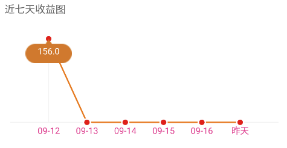

# charts

##Features


一个金额随着日期变化的简单折线图

##Usage

### XML
```XML
<com.soongkun.linechart.view.LineChartView
    android:id="@+id/chart"
    android:layout_width="match_parent"
    android:layout_height="200dp"
    android:layout_margin="30dp"
    android:layout_marginTop="50dp"
    android:background="@color/white"/>
```

### JAVA
```
mChart = (LineChartView) findViewById(R.id.chart);
MarkView markView = new MarkView(this);
mChart.setMarkView(markView);


//To bind the dataset
List<PointValue> values = new ArrayList<>();

values.add(new PointValue(120, "09-07"));
values.add(new PointValue(45, "09-08"));
values.add(new PointValue(0, "09-09"));
values.add(new PointValue(67, "09-10"));
values.add(new PointValue(33, "09-11"));
values.add(new PointValue(89, "09-12"));
values.add(new PointValue(200, "09-13"));

mChart.setData(values);

```


